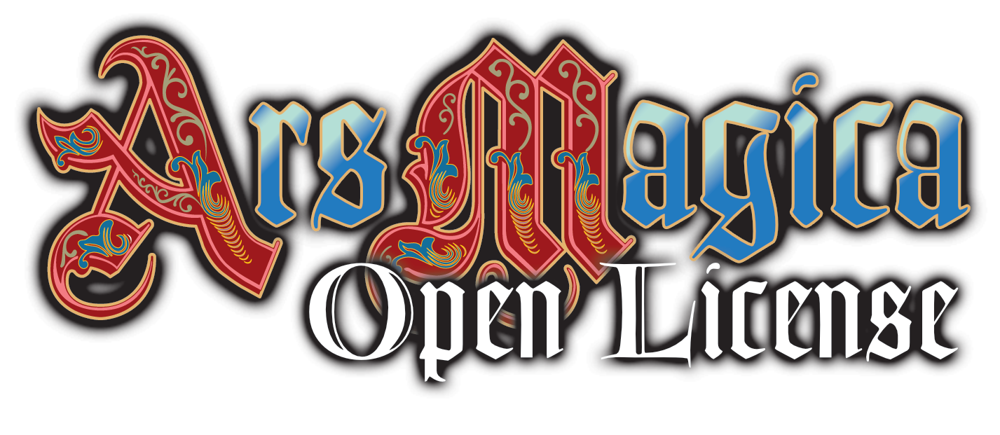

<p align="center">
  
</p>

<h1 align="center">Ars Magica 5th Edition Character Generator</h1>

<p align="center">
  A locally installed, cross-platform desktop generator for <strong>Ars Magica 5th Edition</strong> characters and covenants.
</p>

<p align="center">
  <a href="#status"></a>
  
  
  
  
</p>

---

## What it does

This is a — fully vibe coded — native desktop application for building **Ars Magica 5th Edition**
characters — grogs, companions, mythic companions, and magi — as well as
**covenants**. Both characters and covenants are first-class entity types built
on one shared rules engine.

Three input modes cover the spectrum from hand-holding to power-user:

- **Guided wizard** — step through creation phase by phase, validated at each step.
- **Direct, validated** — enter choices freely with live rule checking.
- **Direct, unchecked** — full manual control, validation suppressed.

Everything runs locally. There is no server, no account, and no telemetry. Saves
are plain JSON that record your *choices* (plus the ruleset id and version), so
they stay portable and diff-friendly.

Currently, this is work in progress. The current state of development is described below.

## Download

Grab the latest build from the
[**releases page**](https://github.com/garin1000/Ars-Magica-Character-Generator/releases/latest).

| Platform | File | How to install |
|----------|------|----------------|
| Linux, any distro | `.AppImage` | `chmod +x` it and run — installs nothing |
| Linux (Debian, Ubuntu) | `.deb` | `sudo apt install ./<file>.deb` |
| Linux (Fedora, openSUSE) | `.rpm` | `sudo dnf install ./<file>.rpm` |
| Windows 10/11, 64-bit | `.msi` **or** setup `.exe` | Either installer works — pick one |

**Requirements.** On Linux the app renders in the system WebView, so it needs
**WebKitGTK 4.1** (`libwebkit2gtk-4.1-0` on Debian/Ubuntu, `webkit2gtk4.1` on
Fedora, `webkit2gtk-4.1` on Arch); the `.deb` and `.rpm` pull it in for you. On
Windows it needs the **WebView2 runtime**, which is preinstalled on Windows 11
and on up-to-date Windows 10.

**Blank white window from the AppImage on Wayland?** AppImages before 0.2.1
bundled a libwayland too old for a current Mesa, so the WebView aborted with
`Could not create default EGL display: EGL_BAD_PARAMETER` and the window stayed
empty. Download 0.2.1 or newer; to rescue an older one, launch it with
`LD_PRELOAD=/usr/lib/libwayland-client.so.0 ./<file>.AppImage` (the path is
`/usr/lib/x86_64-linux-gnu/libwayland-client.so.0` on Debian/Ubuntu). The `.deb`,
`.rpm` and portable builds were never affected.

**The binaries are unsigned.** Windows SmartScreen will warn on first launch —
choose *More info → Run anyway*. The Linux packages are unsigned too.

**There is no prebuilt macOS download.** The app builds and runs on macOS from
source (`cargo tauri build`), but no signed `.dmg` is published.

Prefer something you can drop on a USB stick? `./build-linux.sh` and
`./build-win.sh` produce self-contained portable archives that install nothing
and write no registry entries. These are not published by CI — you build them
yourself.

## Highlights

- **Two languages out of the box** — English and German, for both the UI and the
  rules text. English is the canonical source of truth; German terminology is
  matched against hand-curated EN↔DE glossary tables.
- **Rules-as-data.** Mechanics live in JSON keyed by stable slug IDs
  (`virtue.puissant_ability`, `art.creo`, `house.bjornaer`). Translatable text is
  kept strictly separate from mechanics and from UI strings.
- **One evaluation path.** The engine always computes the full validation result;
  a `ValidationMode` (Enforced / Advisory / Silent) decides how strictly it is
  applied — there is no separate "rules off" code branch. In Enforced mode a
  Virtue/Flaw that an already selected one excludes is greyed out with the reason,
  so the illegal pairing cannot be picked at all.
- **Referential integrity enforced at load.** Every prerequisite and
  incompatibility reference must resolve, and incompatibilities must be symmetric,
  or loading fails loudly with the offending IDs.
- **Source-backed rules.** Every implemented mechanic is traced to a line range
  in the authoritative rulebook Markdown — no rules from memory.
- **Works like a standard document app.** A tracked current file with New, Open,
  Save and Save As — plus the usual Ctrl/Cmd+N/O/S (Shift+S for Save As)
  shortcuts. The window title shows the file name and marks unsaved edits; Save
  writes straight to the current file while Save As always prompts.
- **Never lose work by accident.** Closing or quitting the app with unsaved
  changes — including via macOS Cmd+Q — prompts for confirmation before
  discarding, as does starting a new document or opening another file.
- **Export a readable character sheet.** One click writes the whole character to a
  Markdown file of your choosing — identity, Characteristics, Virtues and Flaws
  (including the ones a House or type granted), Abilities, Arts, spells,
  equipment, the computed combat/Soak/Fatigue/Wound values, the magic possessions,
  and the aging record — in the language the app is running in. Exporting is not a
  save: it never touches your current file or its unsaved-changes state.

## Architecture

The codebase is split so that all game logic is pure and independently testable,
with the desktop shell as a thin layer on top.

| Concern             | Choice                                                          |
|---------------------|----------------------------------------------------------------|
| Shell / packaging   | **Tauri 2** — native binary using the OS webview               |
| Core logic          | **Rust** — pure library crate (`arm-rules`), no IO, no UI deps |
| Frontend            | **Svelte 5 + Vite** (SPA, no SSR)                              |
| UI localization     | **Fluent** (`.ftl`)                                            |
| Rules + save format | **JSON** via `serde`                                           |

```
arm-char-gen/
├── crates/
│   ├── arm-rules/        # PURE engine: types, parse, validate, evaluate
│   └── arm-app/          # Tauri binary; file IO + commands
├── ui/                   # Svelte 5 + Vite frontend (SPA)
├── rules/
│   ├── source/<lang>/    # authoritative human-authored rulebook Markdown
│   ├── core/             # language-neutral mechanics (JSON)
│   └── i18n/<lang>/      # translatable rules text, keyed by stable IDs
├── locales/<lang>/       # Fluent UI strings
└── examples/             # sample saves for tests and demos
```

The engine (`arm-rules`) has **no dependency on Tauri, the filesystem, or the
UI**. It operates on in-memory data and is fully exercised with `cargo test`.
Characters and covenants share a single entity-generic abstraction, so covenant
support is new data plus thin UI — never an engine rewrite.

## Status

Active development. The engine, Tauri integration, and a direct-entry UI are in
place and tested end to end (engine unit tests, webview-free command integration
tests, and a real-binary `tauri-driver` E2E). Any core-rules character is fully
enterable **and** fully computable in direct entry — milestone M5 complete, with
Markdown export added in M5.6.

### What works today

- **Character creation.** The app opens on a startup screen offering three ways in:
  open an existing character, create a new one directly, or walk one through the
  guided wizard — the latter two with one button per character type the ruleset
  declares (grog, companion, mythic companion, magus). The type is chosen once, at
  creation, and is shown read-only in the editor afterwards. Characters are then
  built with virtues/flaws, point-buy Characteristics, whole bought Ability
  scores, and — for magi — whole bought Hermetic Art scores, with Abilities and
  Arts drawing from one shared experience pool, all validated live. The Arts,
  Spells, and Magic Items tabs appear only for magus-capable types.

- **Magic Items: devices and the Longevity Ritual.** The Magic Items tab stores a
  magus's starting possessions — aura, enchanted devices (charged against the
  item-level budget their Virtues grant), a familiar, a talisman, and a self-made
  or external Longevity Ritual with its aging bonus, its focus, and the permanent
  sterility it causes. Because the ritual's bonus was fixed by the Lab Total of
  the season it was made, it is entered and stored rather than derived; beside the
  input the engine suggests what a ritual made now would be worth, from the live
  Creo Corpus Lab Total, halvings included.

- **Talisman.** The magus's personal enchanted item: its shape and material, its
  shape-and-material attunements, and the effects instilled in it, with a
  read-only capacity read-out (highest Technique + highest Form, in pawns of Vim
  vis) beside them.

- **Familiar.** Entered as the magical animal it is, in the rulebook's own
  creature format: the animal, its Magic Might, the eight Characteristics, a
  (usually negative) Size, Personality Traits, the Gold/Silver/Bronze bond cords,
  and the powers invested in the bond — with read-only guidance for the bonding
  level (Might + 25 + 5 × Size), the best bonding Lab Total, what the cords cost
  off the 5/15/30/50/75 curve, and the total level invested. The bond's own grants
  (True Friend, Loyal (partner) +3, Intelligence -3) are shown as a note rather
  than applied silently, and no number the familiar carries can ever raise a
  validation error.

- **Equipment.** An Equipment tab — available to every character type — records
  the weapons, shields, and armor a character carries from the Core Rules
  equipment catalogue (English + German), marking each equipped.

- **Catalogues.** The full Core Rules Ability catalogue and the full 15-Art
  catalogue (English + German) ship with localized descriptions; abilities also
  carry example specialties and the "cannot be used untrained" marker, and the
  complete Core Rules spell catalogue ships with each spell's Range/Duration/Target
  and ritual legality.

- **Score-boosting Virtues.** Puissant Ability, Puissant Art +3 and Great
  Characteristic compute an effective score that drives prerequisites, the +5
  characteristic ceiling, and a read-only display badge.

- **Experience-effect Virtues.** Affinity (Ability/Art) reduces the XP charged for
  its target; the restricted-pool Virtues (Educated, Warrior, Privileged
  Upbringing) grant experience spendable only on eligible Abilities, allocated by
  a max-flow solve so overlapping pools resolve correctly; Improved Characteristics
  raises the Characteristic-buy budget; and starting-score Virtues (Second Sight,
  Premonitions) confer their Ability at a free floor.

- **Details, aging and Warping.** The Details tab captures identity/flavor fields
  (name, gender, birth year, Wizard's sigil, covenant, parens) and an already-aged
  / already-warped character's raw state — aging points and completed
  Characteristic reductions, Warping Points, and free-text Twilight Scars — from
  which the engine derives the Decrepitude and Warping scores (aging reductions
  lower derived/play stats but never the point-buy the creation checks read).

- **In-play effects and the totals read-out.** Every in-play Virtue/Flaw effect
  (Magical Focus, Method Caster, Deficient Technique/Form, Tough, and the rest of
  the 653-entry catalogue) is modelled, and a read-out panel computes the full
  in-play totals in-engine from a numeric aura input — per-Technique/Form Lab and
  Casting Totals, per-spell Penetration, per-Form Magic Resistance, combat lines
  (a one-handed weapon reads out twice while a shield is equipped: with the
  shield, and bare), Soak, Encumbrance, fatigue and wound ranges, and the stored
  Longevity bonus beside the suggestion for a ritual made today.

- **Markdown export.** A finished character exports as a formatted Markdown
  sheet: the engine assembles the document from the character and the localized
  rules text while the section headings come from the UI's own Fluent strings, so
  the sheet is localized without any user-facing text living in the engine. The
  per-line casting/lab read-outs are deliberately left out as export noise.

- **Guided creation wizard.** The third input mode walks a character through its
  type's creation phases in the order the ruleset declares them, mounting the same
  input surfaces the editor's tabs use — so the two can never drift apart. Each
  step shows only its own validation findings and refuses to advance while it holds
  an error; Back and the step rail move freely through everything already visited.
  A closing Review step reports what no step could (equipment, Might, Warping,
  aging) and hands the finished character to the ordinary editor. Which mode
  enforces the gate is still the validation-mode control: Advisory and Silent stop
  it gating at all.

- **Life-stage experience.** A character can earn its Abilities the way the rules
  grant them — 75 points of native language and a restricted 45-point spread in
  early childhood, then 15 a year (20 with Wealthy, 10 with Poor) to its age —
  instead of typing one experience total. Pick the source of experience on the
  Abilities step: the flat pool asks for one total, while the guided flow asks for an
  age and a native language and then shows what each life stage earns, with the
  editable pool replaced by the derived budget. The save records only the choices, so
  every figure is re-derived; and each block funds only what it may, so childhood's
  native-language points cannot quietly pay for a second language.

- **Sample Childhood packages.** Early childhood can be filled from one of the five
  ready-made childhoods instead of divided by hand. The packages are rules data,
  re-priced against the advancement table at load so a transcription slip cannot
  ship; the picker asks for the parameters a package leaves open (which regions its
  Area Lores cover, which second language it teaches), previews the result, and
  refuses a form the engine rejects — pointing at the field that is wrong. Applying
  raises scores and never lowers them, so taking a package twice changes nothing, and
  the Abilities it writes stay ordinary editable rows afterwards. A magus keeps the
  flat pool for now: its apprenticeship years are not modelled yet.

### Next

The magus's own life stages: **apprenticeship** (240 experience across Arts and
Abilities, 120 levels of spells, the minimum Parma Magica / Magic Theory / Latin the
Order admits) and the post-Gauntlet years, which is also what opens the guided flow to
magi. After that: aging for characters over 35 (die results typed by the player, so
the engine stays deterministic). See [PLAN.md](PLAN.md) for the milestone breakdown
and [M6B-IMPLEMENTATION.md](M6B-IMPLEMENTATION.md) for the slice-by-slice plan.

## Getting started

### Prerequisites

- **Rust** (2024 edition) and Cargo
- **Node.js** + npm (for the Svelte frontend)
- The [Tauri 2 prerequisites](https://v2.tauri.app/start/prerequisites/) for your
  platform (on Linux, this includes WebKitGTK)

### Run the app in development

```bash
cargo tauri dev
```

### Run the test suites

```bash
# Rust engine tests
cargo test -p arm-rules

# Entire Rust workspace
cargo test --workspace

# Lint (warnings treated as errors) and format check
cargo clippy --workspace -- -D warnings
cargo fmt --check

# Frontend
cd ui && npm run dev          # dev server
cd ui && npm run lint         # eslint + prettier
cd ui && npm run test:unit     # vitest
cd ui && npm run format:check  # prettier

# Real-binary E2E. Needs tauri-driver and webkit2gtk-driver. Runs headful on a
# desktop and headless via xvfb-run where there is no display (ssh, CI) — same
# command either way; on a headless box also install the xvfb package.
cd ui && npm run test:e2e
```

## Rules sources & licensing

This project deliberately separates two bodies of work under two licenses. The
split follows *what the content is*, not which folder it sits in:

- **The generator and the data format — MIT.** The Rust crates, the
  Svelte/TypeScript frontend, the Fluent UI strings (`locales/`), the sample
  saves (`examples/`), the tooling (`scripts/`), the build config, **and the
  rules JSON's form**: its schema, key names, the stable slug-ID scheme, the file
  layout, and all of `rules/core/` — numbers, enums, prerequisite structures and
  source citations, with no rulebook text in it. See [`LICENSE`](LICENSE) and
  [`rules/core/LICENSE`](rules/core/LICENSE).
- **The Ars Magica rules text — CC BY-SA 4.0.** The authoritative Markdown in
  `rules/source/<lang>/` in full, **and the rules text extracted from it into the
  string values of `rules/i18n/<lang>/`** — the spell, Virtue/Flaw, Ability, Art,
  House and equipment names and descriptions, much of it verbatim rulebook prose.
  Derived from material ©1993–2024 Trident, Inc. d/b/a Atlas Games and
  redistributed under the **Ars Magica Open License** (Creative Commons
  Attribution-ShareAlike 4.0). Translations of that text are derivatives and are
  CC BY-SA 4.0 too. See [`rules/source/LICENSE`](rules/source/LICENSE) and
  [`rules/i18n/LICENSE`](rules/i18n/LICENSE).

  In plain terms: **reusing the format needs only MIT — writing your own data
  against this schema, translating into a new language, or building tooling on
  it. Redistributing or adapting the Ars Magica text keeps CC BY-SA 4.0 with
  attribution.**

- **Rule provenance** — every implemented mechanic is traced back to its source
  passage (book + line range) in
  [`crates/arm-rules/RULES.md`](crates/arm-rules/RULES.md), the single
  traceability map for the engine.

The rulebook Markdown originates from these Open License repositories:

- **English** — [OriginalMadman/Ars-Magica-Open-License](https://github.com/OriginalMadman/Ars-Magica-Open-License),
  via the fork at [garin1000/Ars-Magica-Open-License](https://github.com/garin1000/Ars-Magica-Open-License)
- **German** — [garin1000/Ars-Magica-Open-License-German](https://github.com/garin1000/Ars-Magica-Open-License-German)

Installers and portable archives ship both bodies of work side by side, with
[`rules/NOTICE.md`](rules/NOTICE.md) travelling alongside them to carry the full
attribution.

*Ars Magica is a trademark of Trident, Inc. d/b/a Atlas Games. This is an
unofficial fan tool and is not affiliated with or endorsed by Atlas Games.*
